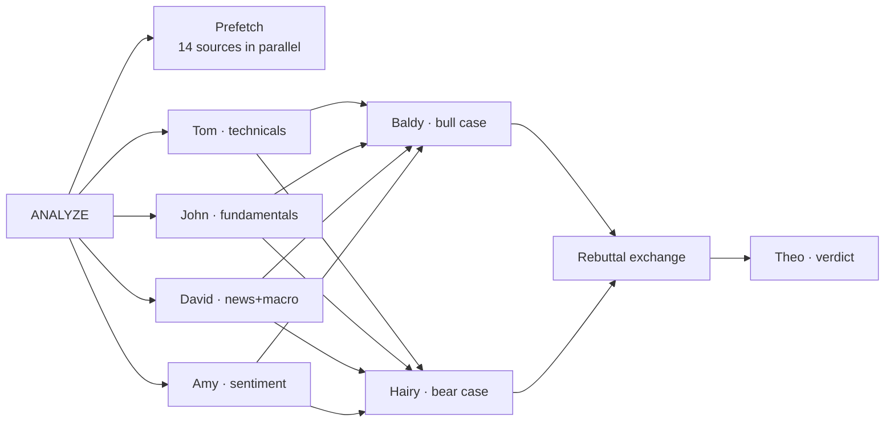

# Pixel Office Firm

A multi-agent LLM system that analyzes automotive companies, structured as a small
consulting firm and visualized as a pixel-art office. Seven agents — four analysts, two
researchers, and a representative — gather live market data, argue a bull-vs-bear debate,
and produce a written verdict. The whole process renders in real time on a local web page:
each agent has a desk, their data appears on the office wall screens, and their progress
is streamed as speech bubbles and console lines.

The agent organization follows
[TradingAgents: Multi-Agents LLM Financial Trading Framework](https://arxiv.org/abs/2412.20138)
(Xiao, Sun, Luo, Wang), adapted from a trading desk into a consulting unit: instead of
buy/sell signals, the output is a qualitative outlook with separate financial and
engineering sub-scores.


*A run in progress: the four analysts have filed their reports (✓), Baldy and Hairy are
writing opposing cases in parallel, the wall screens show the actual price chart and
sentiment data the agents just fetched, and the console logs each step.*

## How a run works

Entering a ticker and pressing ANALYZE starts a pipeline with four stages:



1. **Analysts (parallel).** Tom, John, David, and Amy each run a fixed set of data
   commands and write a report covering only their own domain. In parallel, the server
   pre-warms the data cache so agent commands return instantly.
2. **Cases (parallel).** Baldy and Hairy read the four analyst reports and write opposing
   research cases — deliberately blind to each other, so neither argument is shaped by
   the other.
3. **Rebuttal exchange.** Each researcher then reads the other's case and adds a rebuttal
   section that quotes and counters the opponent's strongest points.
4. **Verdict.** Theo reads the six reports (frontmatter first, full bodies where agents
   disagree) and writes the verdict: a five-tier outlook over a 6–12 month horizon,
   sub-scores for Financial Outlook and Engineering Health, both sides of the debate
   presented, and a confidence level computed from a three-check rubric (data coverage,
   agent agreement, evidence recency).

There is also a **digest** mode: a cheap daily pass over all 12 covered tickers (price
moves, headlines, sentiment, last-verdict ages) that Theo turns into a short morning
briefing displayed in the left panel.

The "Engineering Health" sub-score exists because cars are hardware: the researchers weigh
production data (OICA), EV adoption (IEA), and NHTSA recall/complaint patterns alongside
the financial picture. In the first real engagement this surfaced a recurring
fastener-recall pattern across unrelated safety systems —
[the RIVN verdict](reports/RIVN/2026-07-11-verdict.md) is included as a sample.


## How it's built

The system has three layers:

**Agents** are [Claude Code](https://code.claude.com) subagent definitions
(`.claude/agents/*.md`) — a markdown file per agent containing its role, its data
commands, its report requirements, and its model assignment (analysts run on a fast
model, researchers and Theo on a stronger one). The pipeline itself is a Claude Code
slash command (`.claude/commands/analyze.md`) that dispatches the subagents in order.
The web UI launches runs headlessly via `claude -p "/analyze <TICKER>"`.

**Dataflows** (`dataflows/`) is a plain Python layer: one module per data source, exposed
through a single CLI (`python -m dataflows <module> <command> <ticker>`). Agents never
call APIs directly — they run these commands via bash and read the markdown output.
Responses are cached in SQLite with per-class TTLs (quotes 15 min, news 6 h, fundamentals
7 d). Every source is free; three need API keys (Finnhub, FRED, Reddit).

**The office** (`office/`) is a FastAPI server plus a single-file HTML5 canvas page.
Agents log telemetry (start/work/finding/done events) to `data/events.jsonl` — partly
automatic (every dataflows command logs itself when given `--agent`), partly explicit
(agents log key findings as they discover them). The server tails this file over
server-sent events, and the page animates it: desk activity, walk paths between rooms,
speech bubbles, real fetched data on the wall screens, a stage progress bar, and an
activity console. Some office decor is data-driven — the whiteboard tallies real
bull/bear verdict history and the corkboard pins the last five verdict cards. The
character spritesheet is generated by `scripts/make_sprites.py` (Pillow), so there are
no external art assets.

Reports follow a strict contract (`docs/report-contract.md`): YAML frontmatter with
stance, confidence, key findings, and sources, validated by
`scripts/validate_report.py`, which every agent runs on its own output. Design
decisions made during development are recorded in `docs/pre-build-decisions.md`, and the
full data-source research is in `docs/data-source-catalog.md`. The project was built
iteratively with Claude (Cowork + Claude Code), which also explains the `CLAUDE.md`
context file at the repo root.

## Running it

```bash
git clone https://github.com/Tgeon/pixel-office-firm && cd pixel-office-firm
uv sync
cp .env.example .env        # add free API keys: Finnhub, FRED (documented in the file)
./scripts/run_office.command   # or: uv run uvicorn office.server:app --port 8787
```

Then open http://localhost:8787. Analysis runs require
[Claude Code](https://code.claude.com) installed and authenticated; alternatively run
`/analyze TSLA` inside Claude Code itself and use the page as a viewer.

Without API keys, the floor and ticker tape still work, and
`uv run python scripts/demo_events.py` stages a scripted run so the animation can be
seen without spending anything.

In VS Code, common actions are available as Run Tasks (start the office, unit tests,
live smoke test, demo, dataset refresh), and recommended extensions are suggested on open.

## Repository layout

```
.claude/agents/    seven subagent definitions (the firm)
.claude/commands/  /analyze and /digest pipeline commands
dataflows/         data-source modules + unified CLI
office/            FastAPI server + canvas floor (office/static/index.html)
scripts/           smoke test, report validator, sprite generator, demo events
reports/           engagement outputs (RIVN kept as a sample)
digest/            morning digests
docs/              data-source catalog, decision record, report contract, media
tests/             mocked unit tests (no network needed)
```

## Data sources

| Source | Provides |
|---|---|
| yfinance | price history, fundamentals, analyst consensus |
| Finnhub | real-time quotes, company news, insider sentiment |
| FRED | vehicle sales, production, inventories, rates, sentiment |
| SEC EDGAR | XBRL financials, Form 4 insider filings |
| Google News RSS + GDELT | headlines, macro events |
| Reddit (RSS) + StockTwits | investor & enthusiast sentiment, VADER-scored |
| NHTSA | recalls & complaints per make |
| OICA + IEA (via OWID) | global production & EV adoption |

The CLI can be used standalone: `uv run python -m dataflows finnhub quote TSLA`

## References

- [TradingAgents: Multi-Agents LLM Financial Trading Framework](https://arxiv.org/abs/2412.20138)
  (Xiao, Sun, Luo, Wang) — the agent organization this project adapts
- [Pixel Agents](https://github.com/pixel-agents-hq/pixel-agents) — prior art for
  visualizing coding agents as a pixel office, which inspired the visualization approach
- Data: OICA via [jhelvy/oica](https://github.com/jhelvy/oica), IEA Global EV Outlook via
  [Our World in Data](https://ourworldindata.org/), NHTSA, FRED, SEC EDGAR

## Disclaimer

This is a research and educational project. Nothing it produces is financial,
investment, or trading advice. Do your own research.
