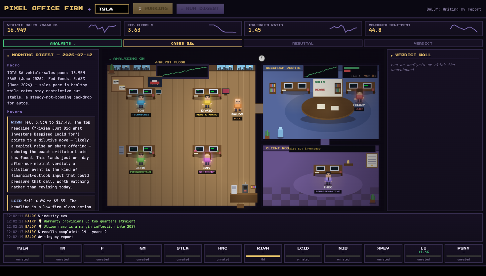
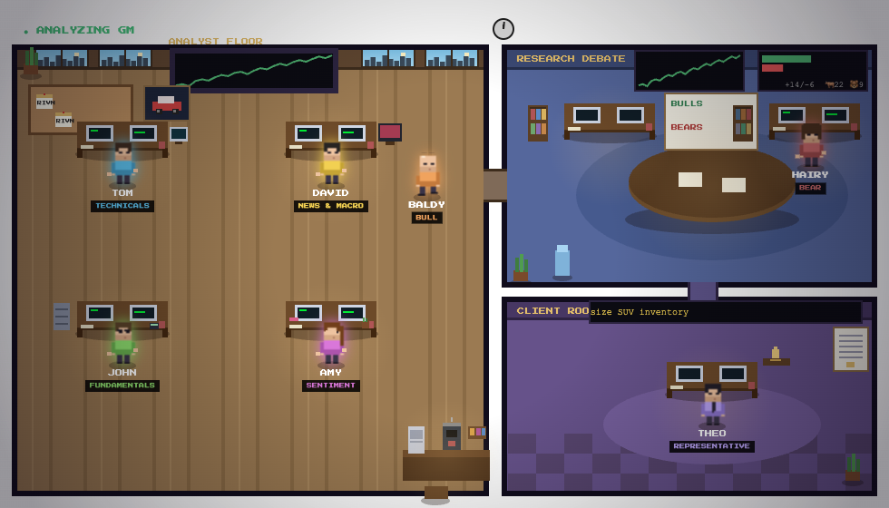
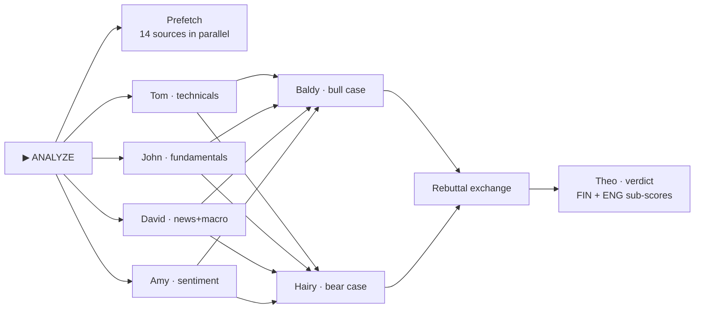

# Pixel Office Firm

**A tiny AI consulting firm that analyzes automotive companies — and you get to watch it work.**

Seven LLM agents with names, desks, and opinions research real market data, debate bull-vs-bear,
and file verdicts — all rendered live as a pixel-art trading floor in your browser.
Built on the [TradingAgents](https://arxiv.org/abs/2412.20138) multi-agent framework,
running on [Claude Code](https://code.claude.com) subagents, fed entirely by free data sources.




*A live run: the analysts have filed (✓), Baldy and Hairy are building opposing cases in
parallel, Tom's real price chart is on the wall screens, Amy's sentiment split fills the
debate-room display, and the activity console narrates every step.*

## What is this?

Type a ticker, press **▶ ANALYZE**, and the firm goes to work:

1. **Four analysts** research in parallel — Tom (technicals), John (fundamentals & SEC filings),
   David (news & macro), Amy (investor + enthusiast sentiment).
2. **Two researchers** write opposing cases *blind to each other* — Baldy argues the bull case,
   Hairy the bear — then exchange rebuttals.
3. **Theo**, the client representative, synthesizes everything into a verdict:
   a five-tier outlook (6–12 month horizon) with **two sub-scores** — Financial Outlook and
   Engineering Health — plus an auditable confidence rubric.

Every agent's work is real: they run CLI dataflows against live market APIs, log telemetry the
office renders (speech bubbles, wall screens, walk paths), and write markdown reports that pass
a schema validator. The office is the interface — the whiteboard tallies real bulls-vs-bears
verdict history, the corkboard pins actual verdict cards.



## Why "Engineering Health"?

Cars are hardware. Alongside the financial picture, the researchers weigh production trends
(OICA), EV adoption (IEA), and **NHTSA recall/complaint patterns** — quality problems often
precede financial ones. The firm's first engagement caught a recurring fastener-recall pattern
across safety systems that pure price analysis would never see:
[read the RIVN verdict](reports/RIVN/2026-07-11-verdict.md).

## The pipeline



There's also **☼ RUN DIGEST** — Theo's morning pass over the whole 12-ticker universe:
macro snapshot, top movers with narrative, and a nudge when a big move challenges a
standing verdict.

## Quickstart

```bash
git clone https://github.com/Tgeon/pixel-office-firm && cd pixel-office-firm
uv sync
cp .env.example .env        # add free API keys: Finnhub, FRED (2-min signups)
./scripts/run_office.command   # or: uv run uvicorn office.server:app --port 8787
```

Open http://localhost:8787. The ANALYZE button drives `claude -p "/analyze <TICKER>"`
headlessly — you'll need [Claude Code](https://code.claude.com) installed and authenticated.
You can also run `/analyze TSLA` inside Claude Code directly and just watch the floor.

No keys? The floor, ticker tape, and demo still work:
`uv run python scripts/demo_events.py` stages a fake run so you can see the office move.

## Repo map

```
.claude/agents/    the seven firm agents (Claude Code subagent definitions)
.claude/commands/  /analyze and /digest pipeline commands
dataflows/         one module per data source → unified CLI (see below)
office/            FastAPI server + the canvas trading floor
scripts/           smoke tests, report validator, sprite generator, demo
reports/           real engagements (RIVN included as a sample)
digest/            morning digests
docs/              data-source catalog, decision record, report contract, media
```

## Data sources (all free)

| Source | Provides |
|---|---|
| yfinance | price history, fundamentals, analyst consensus |
| Finnhub | real-time quotes, company news, insider sentiment |
| FRED | vehicle sales, production, inventories, rates, sentiment |
| SEC EDGAR | XBRL financials, Form 4 insider filings |
| Google News RSS + GDELT | headlines, macro events |
| Reddit (RSS) + StockTwits | investor & enthusiast sentiment, VADER-scored |
| NHTSA | recalls & complaints per make — engineering health |
| OICA + IEA (via OWID) | global production & EV adoption |

Try the CLI directly: `uv run python -m dataflows finnhub quote TSLA`

## Credits

- [TradingAgents: Multi-Agents LLM Financial Trading Framework](https://arxiv.org/abs/2412.20138)
  (Xiao, Sun, Luo, Wang) — the firm's organizational blueprint
- [Pixel Agents](https://github.com/pixel-agents-hq/pixel-agents) — inspiration for
  watching agents work in a pixel office
- Data: OICA via [jhelvy/oica](https://github.com/jhelvy/oica), IEA Global EV Outlook via
  [Our World in Data](https://ourworldindata.org/), NHTSA, FRED, SEC EDGAR

## Disclaimer

This is a research and educational project. Nothing it produces is financial,
investment, or trading advice. Do your own research.
